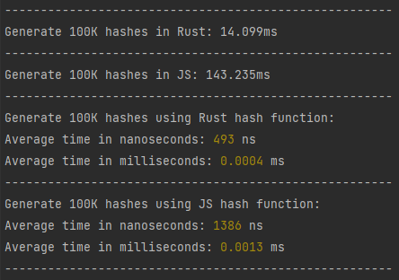
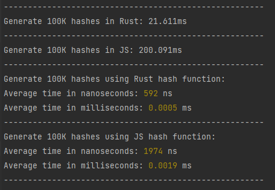

# Rust binary integration in Javascript

## Contact
- Eduardo Sánchez<br>


- whipshout@gmail.com<br>


- https://www.linkedin.com/in/eduardo-sanchez-sanchez/ <br>

## Info

- We can integrate **Rust with Node through native addons**, as we would with **C++**. <br>


- To do this, we have to interact with **Javascript through C**. We compile a **Rust library using C interfaces and bindings**. The library is in different formats depending on the operating system.<br>


- To do all the hard work, we use the **crate called Neon**, which is responsible for making the interfaces and bindings with C and exporting the functions for use in Javascript.

## Neon crate

- **Neon** => https://neon-bindings.com/ <br>


- **Neon Crate** => https://crates.io/crates/neon <br>


- **Neon GitHub** => https://github.com/neon-bindings/neon <br>


- **Neon Examples** => https://github.com/neon-bindings/examples <br>

## How to use this repo

- First you need to have installed **Node, npm and Rust**.<br>


- Second, **clone the repo** and open it with your favourite IDE (**I hope is from JetBrains**).<br>


- Third, you have to use the command ```npm install``` to **generate node modules**.<br>
 

- Fourth, use the command ```npm run build``` to **generate the native addon**. It will be generated in project root as **index.node**.<br>


- And last, use the command ```npm start``` to **execute the Javascript code** with the addon.<br>

## Tests

- You can run the **Rust tests** using the command ```npm run test:rust```.<br>


- You can run the **Javascript tests** using the command ```npm run test:js```.<br>

## Changes

- If you want to change something about Rust code, **don't forget to recompile the addon** using ```npm run build```.<br>


- If you want to change something about Javascript code, you don't have to worry about anything, only **check if the imports of Rust functions are right**.

## Summary
- Neon was **created by one of the Mozilla team members**. It is updated frequently and is **about to release version 1.0**.<br>


- The creators of Neon have also created a package for Javascript called **cargo-cp-artifact** that is responsible for automatically **recovering the appropriate Rust library according to the operating system**.<br>


- This time, I have not checked the performance of the functions, but as we could see when we tested **WebAssembly**, we already gained **a lot of performance at that time without even using native Rust**.<br>


- Looking at the documentation, we can import entire **Javascript classes**, use them as Rust structures, and we can also use **asynchronous programming** without any problem.<br><br>

## Comparison Sha256 hash Rust and JS

<br>

Sha256 **18 bytes** item



<br>

Sha256 **70 bytes** item

